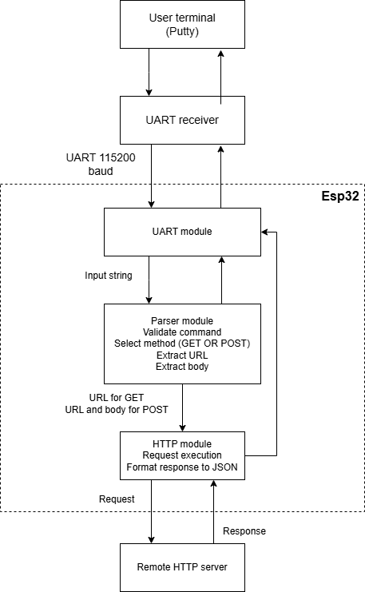

# ESP32 UART–HTTP Client

## Project Overview
This project implements an ESP32-based HTTP client that receives commands via UART and sends HTTP requests to remote servers. The system connects to WiFi, parses incoming commands from a serial terminal, executes GET or POST requests, and returns JSON responses. 

## Block diagram of the program


## How to build
1. Clone repository:
```
$ git clone https://github.com/Mbsqd/uart_http_client.git
```
2. Enter project directory
3. Launch your ESP-IDF Enviroment
4. Build project:
```
idf.py build
```
